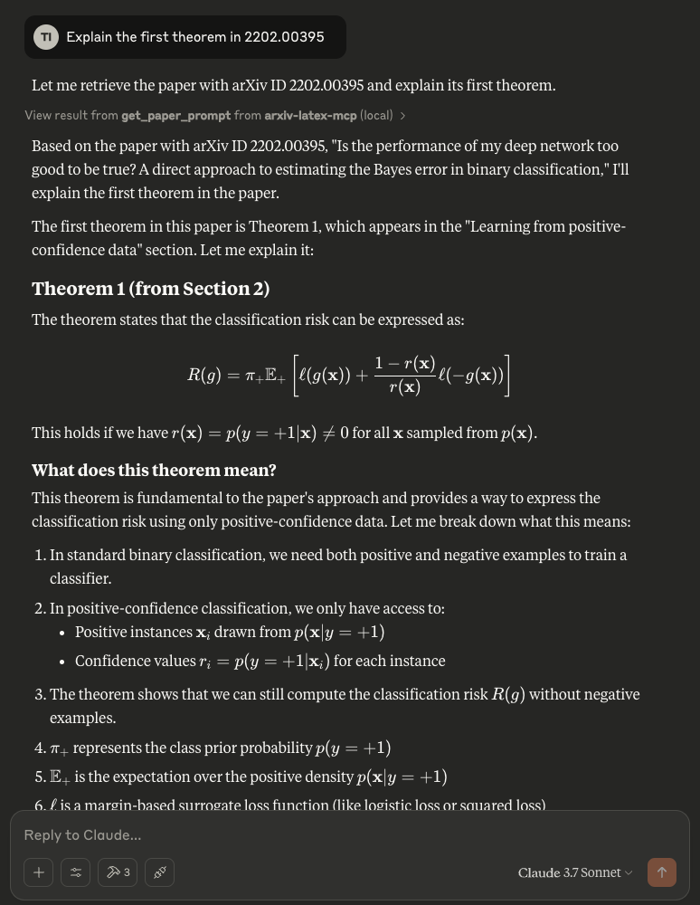

# arxiv-latex MCP Server
[](https://opensource.org/licenses/MIT)
[](https://github.com/takashiishida/arxiv-latex-mcp/releases)


An MCP server that enables [Claude Desktop](https://claude.ai/download), [Cursor](https://www.cursor.com/), or other MCP clients to directly access and process arXiv papers by fetching the LaTeX source. It uses [arxiv-to-prompt](https://github.com/takashiishida/arxiv-to-prompt) under the hood to handle downloading and processing the LaTeX.

Originally authored by [Takashi Ishida](https://github.com/takashiishida) and updated by Ioana Cristescu for Smithery-compatible deployment.

Why use the LaTeX source instead of uploading PDFs? Many PDF chat applications often struggle with mathematical content and equation-heavy papers. By utilizing the original LaTeX source code from arXiv papers, the LLM can accurately understand and handle equations and notations. This approach is particularly valuable for fields like computer science, mathematics, and engineering where precise interpretation of mathematical expressions is crucial.

## Installation

If you are using Claude Desktop and MacOS, you can utilize Desktop Extensions by double-clicking on the .dxt file to install.
Download the .dxt file from [here](https://github.com/takashiishida/arxiv-latex-mcp/releases/).

Otherwise, you can manually add the following configuration to your config file:
```json
{
  "mcpServers": {
      "arxiv-latex-mcp": {
          "command": "uv",
          "args": [
              "--directory",
              "/ABSOLUTE/PATH/TO/arxiv-latex-mcp",
              "run",
              "server/main.py"
          ]
      }
  }
}
```

You may need to replace the `command` field with the full path of `uv`: check this by running `which uv` (MacOS/Linux) or `where uv` (Windows).

Restart the application after saving the above.

For Claude Desktop, click on the hammer icon, and you should see `get_paper_prompt` in the list of "Available MCP tools".

### Local development

```bash
uv sync                  # install dependencies
uv run dev               # launch FastMCP server via Smithery CLI
uv run playground        # open Smithery playground for interactive testing

# or run the legacy stdio entrypoint directly
uv run server/main.py
```

The stdio script delegates to the FastMCP server defined in `src/arxiv_latex_mcp/server.py`, so both Smithery deployments and local debugging use the same tool implementation.

### Deploying on Smithery

This project now ships with a minimal `smithery.yaml` and the required `pyproject.toml` configuration for [Python server deployments on Smithery](https://smithery.ai/docs/build/deployments/python):

1. Ensure your dependencies are locked with `uv lock` and synced locally.
2. Commit and push changes, including `smithery.yaml` and the `src/arxiv_latex_mcp` module.
3. Connect the repository in the Smithery dashboard, then trigger a deployment from the *Deployments* tab.
4. After build, your MCP server will be hosted at `https://server.smithery.ai/<your-server>/mcp`.

## Example
Try asking questions about a paper from arXiv, e.g., "Explain the first theorem in 2202.00395"

<div align="center">
  
</div>

## Credits

- Original implementation inspired by [Takashi Ishida's arxiv-latex-mcp project](https://github.com/takashiishida/arxiv-latex-mcp)
- Smithery deployment updates by Ioana Cristescu
